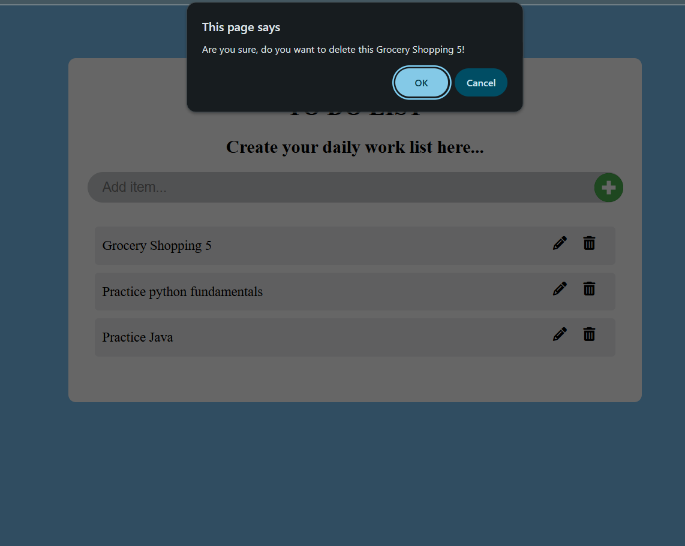
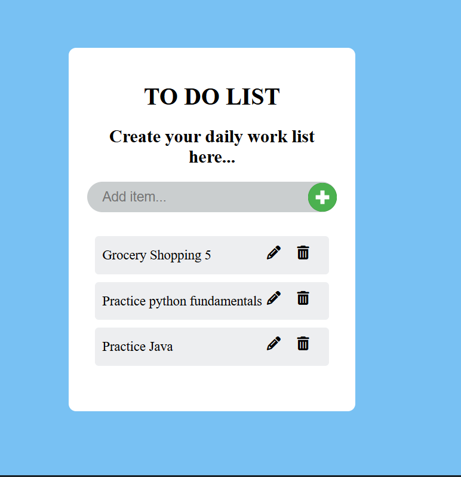
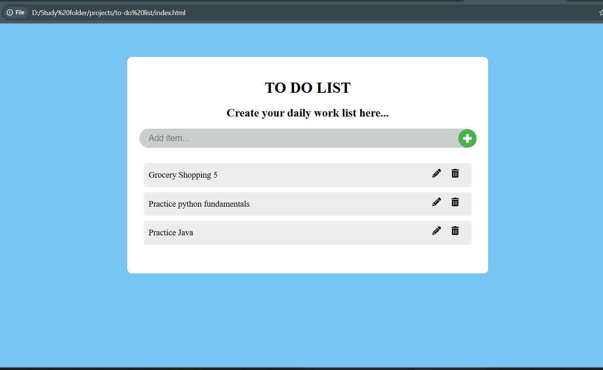

# Currency Converter

A simple and responsive currency converter web application built using HTML, CSS, and JavaScript. It allows users to convert amounts between different currencies using real-time exchange rates.

## Features

- Create a new task
- Update existing task
- Delete a task
- Mark a task as complete

## Tech Stack

- HTML
- CSS
- JavaScript

  
## Screenshots

.

## Authors

- [@Vidhi-0603](https://github.com/Vidhi-0603)

